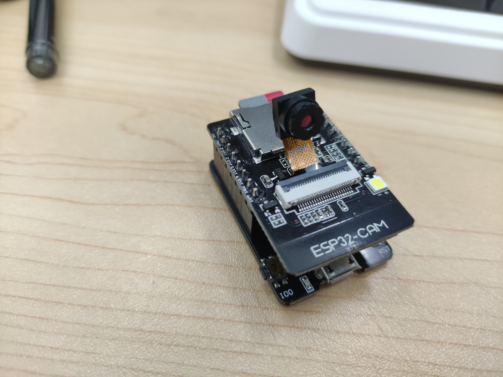

# 智能家居监控摄像机

使用材料: Esp32, ov2640 摄像机

## 总介绍:

设备通电之后会自动连上设定好的局域网 wifi, 用户登录该设备在局域网下的服务地址: http://ip/stream.jpg,
即可查看自 esp32 从 ov2640 摄像机获取的视频信息.

### 开发板简述:

ESP32-CAM 是一款基于 ESP32 芯片的开发板，具有 WiFi 和蓝牙功能，同时还集成了摄像头模块。
它可以通过 Arduino IDE 进行编程，支持多种传输协议和格式，如 HTTP、MQTT、JPEG 等。
ESP32-CAM 可以用于物联网、智能家居、视频监控等领域，具有成本低、易于使用、功能强大等优点。同时，ESP32-CAM 还支持外接 TF 卡存储，可以实现本地存储和远程访问。

[相关信息](https://docs.ai-thinker.com/esp32-cam)

### 开发板 wifi 简述:

ESP32 是一款集成了 WiFi 模块的芯片，它支持 802.11 b/g/n 协议，可以作为 WiFi 客户端或热点进行连接。ESP32 的 WiFi 模块采用了双核设计，其中一个核专门负责 WiFi 协议栈的处理，另一个核则用于用户应用程序的运行。ESP32 的 WiFi 模块还支持多种安全加密方式，如 WPA/WPA2-PSK、WPA/WPA2-Enterprise、802.1X 等。在使用 ESP32 进行 WiFi 通信时，可以通过 Arduino IDE 或其他开发工具进行编程，使用 WiFi 库进行连接和数据传输。同时，ESP32 还支持通过 MQTT 等协议进行远程通信，实现物联网应用。

### 代码目录:

```
src/
    |   bindings.h
    |   camera.rs // 摄像机初始化代码
    |   main.rs // 主程序入口
    |   test.rs // 网络通信测试代码
    |
    \---network
            http.rs // 网络传输代码
            mod.rs
            wifi.rs // wifi配置配置代码
```

详细代码细节可看对应文件.

### 设计图:

```
+----------------+         +----------------+         +----------------+
|                |         |                |         |                |
|   ESP32-CAM    |         |    Router      |         |    Viewer      |
|                |         |                |         |                |
|  +----------+  |         |  +----------+  |         |  +----------+  |
|  |   Camera |  |         |  |          |  |         |  |          |  |
|  +----------+  |         |  |          |  |         |  |          |  |
|                |         |  |          |  |         |  |          |  |
|                |  WiFi   |  |          |  |  WiFi   |  |          |  |
|                | <------>|  |          |  | <------>|  |          |  |
|                |         |  |          |  |         |  |          |  |
|                |         |  |          |  |         |  |          |  |
|                |         |  |          |  |         |  |          |  |
|                |         |  |          |  |         |  |          |  |
|                |         |  |          |  |         |  |          |  |
|                |         |  |          |  |         |  |          |  |
|                |         |  |          |  |         |  |          |  |
|                |         |  |          |  |         |  |          |  |
|                |         |  +----------+  |         |  +----------+  |
|                |         |                |         |                |
+----------------+         +----------------+         +----------------+
```

说明:

- ESP32-CAM：使用 ESP32-CAM 模块来获取视频流并将其传输到局域网内。
- Router：使用路由器来连接 ESP32-CAM 和 Viewer。
- Viewer：使用电脑或移动设备来查看 ESP32-CAM 传输的视频流。

这种设计可以用于实时监控和远程监视，具有以下实用性和使用场景：

### 实用性：

- 实时监控：可以通过 ESP32-CAM 模块获取视频流并将其传输到局域网内，从而实现实时监控。
- 远程监视：可以通过路由器连接 ESP32-CAM 和 Viewer，从而实现远程监视。

### 使用场景：

- 家庭安防：可以将 ESP32-CAM 模块安装在家中，通过路由器连接到 Viewer，实现家庭安防监控。
- 办公室监控：可以将 ESP32-CAM 模块安装在办公室，通过路由器连接到 Viewer，实现办公室监控。
- 宠物监控：可以将 ESP32-CAM 模块安装在宠物的活动区域，通过路由器连接到 Viewer，实现宠物监控。
- 老人看护：可以将 ESP32-CAM 模块安装在老人的居住区域，通过路由器连接到 Viewer，实现老人看护。

### 产品效果



具体实操视频在 `/pictures/actual.mp4`
